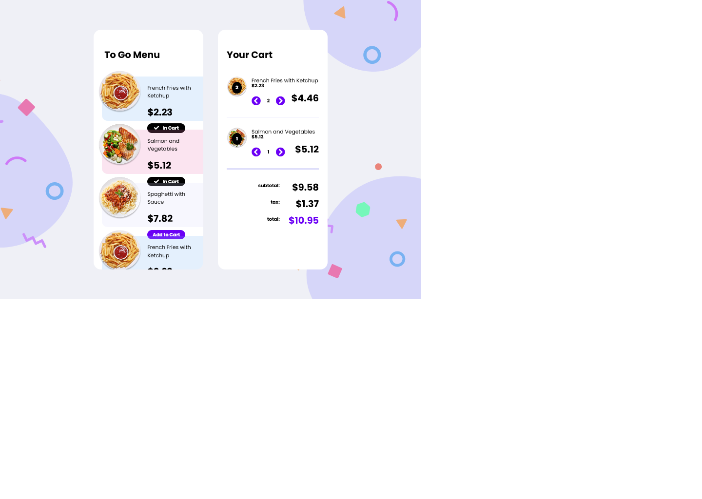

# Frontend Mentor - FAQ accordion card solution

This is a solution to the [FAQ accordion card challenge on Frontend Mentor](https://www.frontendmentor.io/challenges/faq-accordion-card-XlyjD0Oam). Frontend Mentor challenges help you improve your coding skills by building realistic projects.

## Table of contents

- [Overview](#overview)
  - [The challenge](#the-challenge)
  - [Screenshot](#screenshot)
  - [Links](#links)
- [My process](#my-process)
  - [Built with](#built-with)
  - [What I learned](#what-i-learned)
  - [Continued development](#continued-development)
  - [Useful resources](#useful-resources)
- [Author](#author)

## Overview

### The challenge

Users should be able to:

- View the plates on the left side of the screen and add them to your cart on the right side.
- When there are no plates within your cart, you should see a message that says, "Your cart is empty."
- When a plate is added to your cart, the Subtotal and Totals will automatically update.
- When products are in your cart, you should be able to increase and decrease the quantity.
  - A user should not be able to mark the quantity as a negative number.
  - If the quantity goes down to 0, the user will have the option to delete or remove the product for their cart entirely.
- Tax is based on the state of Tennessee sales tax: `0.0975`

### Screenshot



### Links

- Live Site URL: [Live site URL](https://juliflorezg.github.io/Advent-of-CSS-JS-02-eCommerce-component/)

## My process

### Built with

- Semantic HTML5 markup
- CSS custom properties
- BEM CSS methodology
- Flexbox
- CSS grid
- Vanilla JavaScript

### What I learned

- Use of BEM CSS methodology for the menu and cart components
- Use of relative/absolute positioning
- Toggling and removing classes to DOM elements with JavaScript
- How to make reference to sibling & parent elements of an actual element
- Use of flexbox inside a grid component, which is in turn a flex item

```html
<section class="menu">
	<h2 class="menu__title">to go menu</h2>

	<article class="menu__product menu__product--french-fries">
		
		<div class="menu__product-info">
			<p class="menu__product-name">French Fries with Ketchup</p>
			<span class="menu__product-price">$2.23</span>
			<button class="menu__add-button">Add to Cart</button>
			<!-- <button class="menu__add-button"><i class="fas fa-check"></i> In Cart</button> -->
		</div>
	</article>
</section>

<article class="cart__product">
	
	<span class="cart__product-quantity">2</span>
	<div class="cart__product-summary">
		<p class="cart__product-name">Spaghetti with sauce</p>
		<span class="cart__product-unit-price">$7.82</span>
		<div class="cart__product-controls">
			<i class="fas fa-chevron-circle-left"></i>
			<span>2</span>
			<i class="fas fa-chevron-circle-right"></i>
		</div>
		<span class="cart__product-total-price">$15.64</span>
	</div>
</article>
```

```css
.cart__product {
	position: relative;
	max-height: 145px;
	width: 100%;
	margin-block-end: 35px;
	display: flex;
	gap: 15px;
	padding-block-end: 40px;
	/* background-color: rgba(0, 128, 128, 0.1); */
	border-bottom: 1px solid #d7d7f9;
}

.cart__product:last-of-type {
	border-bottom: 5px solid #d7d7f9;
	/* background-color: red; */
}

.cart__product-image {
	width: 70px;
	height: 70px;
}

.cart__product-quantity {
	position: absolute;
	top: calc(35px - 16px);
	left: 35px;
	left: calc(35px - 16px);
	width: 32px;
	/* height: 32px; */
	padding-block: 7px;
	background-color: #000;
	color: #fff;
	font-weight: 700;
	text-align: center;
	vertical-align: center;
	border-radius: 50%;
}

.cart__product-summary {
	display: grid;
	grid-template-columns: repeat(2, 115px);
	grid-template-rows: repeat(2, 22px) 55px;
	grid-template-areas:
		'name name'
		'price .'
		'controls total';
}

.cart__product-name {
	grid-area: name;
	font-size: 18px;
}

.cart__product-unit-price {
	grid-area: price;
	align-self: end;
	font-size: 16px;
	font-weight: 700;
}
.cart__product-controls {
	align-self: end;
	display: flex;
	justify-content: space-between;
	font-size: 32px;
	grid-area: controls;
}

.cart__product-controls span {
	align-self: center;
	font-size: 16px;
	font-weight: 700;
}
.cart__product-controls i {
	color: var(--primary-purple);
	cursor: pointer;
	transition: color 0.3s ease;
}
.cart__product-controls i:hover {
	color: black;
}

.cart__product-total-price {
	grid-area: total;
	align-self: end;

	justify-self: end;
	font-size: 32px;
	font-weight: 700;
}
```

### Continued development

- Positioning of elements with CSS
- Use of CSS grid for layout
- Accessing to DOM element's properties via JS and interacting with them

## Author

- Linkedin - [Julian Florez](https://www.linkedin.com/in/julian-florez-585161153/)
